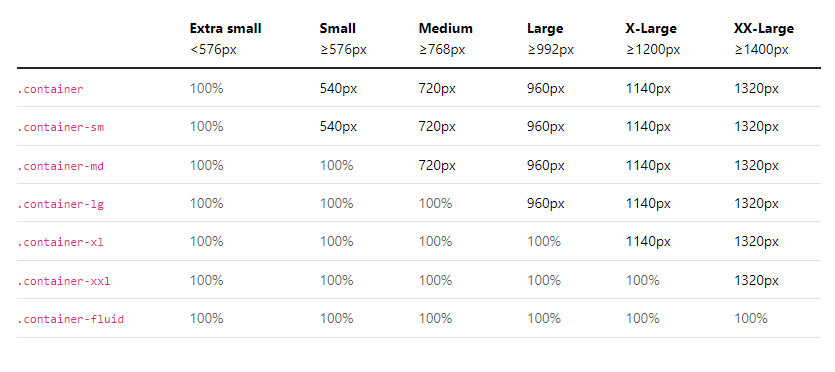

# apnaCollege_Bootstrap

# Bootstrap 
- Bootstrap works on the flexbox concept:
- It has pre-built component.

## Defination
"Bootstrap is a powerful, feature-packed frontend toolkit. Build anything-from prototype to production-in minutes."   
[Official Bootstrap Site](https://getbootstrap.com/)

## Benefits of Bootstrap
- Make development Faster & Easier
- Good choice of pre-built components
- good browser Compatibility


# Using Bootstrap
## Using CDN

**CSS**	    
- https://cdn.jsdelivr.net/npm/bootstrap@5.3.2/dist/css/bootstrap.min.css   

**JS**	
- https://cdn.jsdelivr.net/npm/bootstrap@5.3.2/dist/js/bootstrap.bundle.min.js

**What is CDN?**


## What will we cover?

### Components 
pre-built and reusable piece of user interface (UI).   
eg - button, forms

### Layouts
overall structure and arrangement of the elements.  
eg - container, grid

# Container Layout

Containers are used to contain, pad, and (sometimes) center the content within them.

Bootstrap comes with three different containers:

- `.container`, which sets a `max-width` at each responsive breakpoint      

- `.container-{breakpoint}`, which is `width: 100%` until the specified breakpointm     

- `.container-fluid`, which is `width: 100% `at all breakpoints      

The table below illustrates how each container’s max-width compares to the original .container and .container-fluid across each breakpoint.


  
```css
<div class="container">
  <!-- Content here -->
</div>
```
```css
<div class="container-sm">100% wide until small breakpoint</div>
<div class="container-md">100% wide until medium breakpoint</div>
<div class="container-lg">100% wide until large breakpoint</div>
<div class="container-xl">100% wide until extra large breakpoint</div>
<div class="container-xxl">100% wide until extra extra large breakpoint</div>
```
```css
<div class="container-fluid">
  ...
</div>
```

# Button Components
- Base class  `class ="btn`
```css
<button type="button" class="btn">Base class</button> /* type=button is here because it should not be submit button*/
```


# Badges
- Documentation and examples for badges, our small count and labeling component.

```css
<button type="button" class="btn btn-primary">
  Notifications <span class="badge text-bg-secondary">4</span>
</button>
```

# Alert 


# Button Group